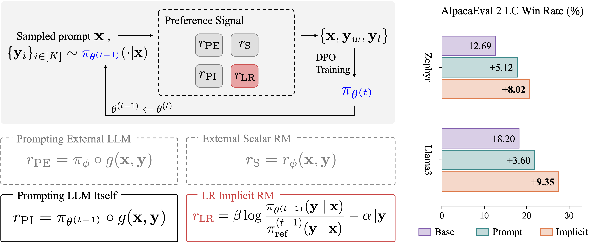

# Bootstrapping with DPO Implicit Rewards (DICE)

This repository contains the implementation of our paper Bootstrapping Language Models via DPO Implicit Rewards. We show that the implicit reward model from the prior DPO training can be utilized to bootstrap and further align LLMs.

</img>

## Quick links
- [Setup](#setup)
    - [Install dependencies](#install-dependencies)
    - [Setup the bash script](#setup-the-bash-script)
- [Training scripts](#training-scripts)
- [Acknowledgement](#acknowledgement)
- [Citation](#citation)

## Setup
### Install dependencies
Please install dependencies using the following command: 
```bash
git clone https://github.com/sail-sg/dice.git
conda create -n dice python=3.10
conda activate dice
cd dice/llama-factory
pip install -e .[deepspeed,metrics,bitsandbytes]

cd ..
pip install -e .
pip install -r requirements.txt

# optional to install flash attention
pip install flash-attn --no-build-isolation
```

### Setup the bash script
Provide the local path to this repo to `DICE_DIR` in two files: 
- `scripts/run_dice/iter.sh`
- `scripts/run_dice/pipeline.sh`

E.g. `DICE_DIR="/home/username/dice"`

## Training scripts
We provide the sample training scripts for both Llama3 and Zephyr settings. It is recommend to run the script with `8x A100 GPUs`. For other hardware environment, you might need to adjust the script. 

- Llama3
  ```bash
  bash scripts/run_dice/iter.sh llama3
  ```

- Zephyr
  ```bash
  bash scripts/run_dice/iter.sh zephyr
  ```


## Acknowledgement
This repo is built on [LLaMA-Factory](https://github.com/hiyouga/LLaMA-Factory). Thanks for the amazing work!

## Citation
Please cite our paper if you find the repo helpful in your work:

```bibtex
@article{chen2024bootstrapping,
  title={Bootstrapping Language Models via DPO Implicit Rewards},
  author={Chen, Changyu and Liu, Zichen and Du, Chao and Pang, Tianyu and Liu, Qian and Sinha, Arunesh and Varakantham, Pradeep and Lin, Min},
  year={2024}
}
```